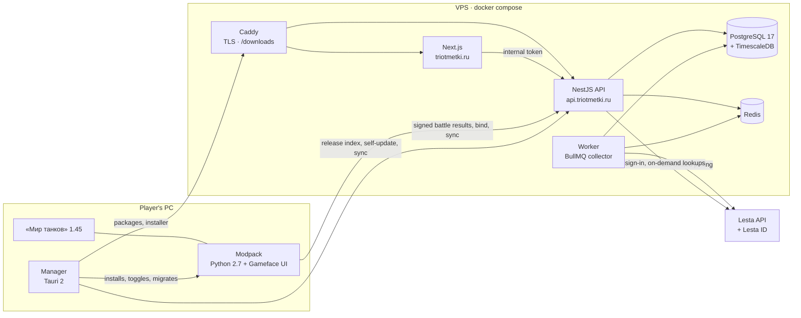

<p align="center">
  
</p>

<h1 align="center">Три отметки</h1>

<p align="center">
  <strong>The all-in-one companion for «Мир танков»: a site, a public API, a game modpack and its manager.</strong>
</p>

<p align="center">
  <a href="https://triotmetki.ru"></a>
  <a href="https://api.triotmetki.ru"></a>
  
  
</p>

<p align="center">
  <a href="#whats-inside">What's inside</a> ·
  <a href="#how-it-fits-together">How it fits together</a> ·
  <a href="#quick-start">Quick start</a> ·
  <a href="#commands">Commands</a> ·
  <a href="#testing-and-ci">Testing and CI</a> ·
  <a href="#docs">Docs</a>
</p>

---

Три отметки is one place for everything a «Мир танков» (Lesta, RU realm) player looks up between battles, plus a modpack that shows the rest in the game. It is an independent fan project, not affiliated with Lesta Games. The whole product lives in this Bun-workspaces monorepo: the site and its API, the collector that pulls the Lesta API, the Python 2.7 game modpack, the desktop manager that installs it, and the packages they share.

| Production | URL                                                                                                         |
| ---------- | ----------------------------------------------------------------------------------------------------------- |
| Site       | [triotmetki.ru](https://triotmetki.ru)                                                                      |
| API        | [api.triotmetki.ru](https://api.triotmetki.ru) (public reference: `/v1/docs`)                               |
| Downloads  | `https://triotmetki.ru/downloads/` (modpack packages, manager installer, the release index `releases.json`) |

> [!IMPORTANT]
> Game data comes from the [Lesta API](https://developers.lesta.ru) under its terms, and they are hard rules here ([details](docs/research/data/lesta-api.md)):
>
> - every page carries the Lesta attribution footer;
> - game accounts link only through Lesta ID (OpenID), never with a password;
> - no ads;
> - data retention and deletion requests are honoured.
>
> The mod is fair play: it shows only the player's own data and what the client already shows, never enemy positions, reloads, aim or ally-spot markers.

## What's inside

| App or package                                               | What it is                                                                                                                                         |
| ------------------------------------------------------------ | -------------------------------------------------------------------------------------------------------------------------------------------------- |
| [`apps/web/client`](apps/web/client/README.md)               | The site: Next.js 16 / React 19, Feature-Sliced Design, next-intl (ru/en), SCSS modules, visx charts, PWA                                          |
| [`apps/web/server`](apps/web/server/README.md)               | NestJS 11 on Bun, one image with two entrypoints: the API (`src/main.ts`) and the collector worker (`src/worker.ts`); Prisma 7, TimescaleDB, Redis |
| [`apps/game/modpack`](apps/game/modpack/README.md)           | The game-client modpack: Python 2.7 `.mtmod` packages (core, companion, 40+ feature components), Gameface UI pages, the component catalogue        |
| [`apps/game/manager`](apps/game/manager/README.md)           | The modpack manager: Tauri 2 (Rust core, React UI) Windows app that installs, toggles and updates the modpack and moves it after a client patch    |
| [`packages/ratings`](packages/ratings/README.md)             | Pure rating math: WN8, EFF, Броня-Индекс, rating tiers, recent periods, marks-of-excellence projection                                             |
| [`packages/schemas`](packages/schemas/README.md)             | Zod contracts shared by the client and the server                                                                                                  |
| [`packages/gamedata`](packages/gamedata/README.md)           | Pure loadout calculator (`calculateLoadout`), ballistics and armor math, and the game-data model they read                                         |
| [`packages/icons`](packages/icons/README.md)                 | The custom SVG icon set as React components; `@otmetki/icons/shapes` is its framework-free geometry                                                |
| [`packages/design-tokens`](packages/design-tokens/README.md) | Design tokens as SCSS maps and mixins for the site, the manager and the in-game window                                                             |
| [`packages/sdk`](packages/sdk/README.md)                     | `@otmetki/sdk`: the TypeScript client for the public `/v1` API and its webhooks (MIT)                                                              |
| [`packages/logger`](packages/logger/README.md)               | The shared pino configuration                                                                                                                      |
| `e2e/`                                                       | Playwright smoke tests over the public pages, plus a screenshot tour                                                                               |
| `infra/caddy/`                                               | The Caddyfile of the production [docker-compose.yml](docker-compose.yml)                                                                           |
| [`docs/`](docs/README.md)                                    | Product scope, architecture, style guides, research, ops, design specs                                                                             |

`packages/` holds only code shared between apps; anything a single app uses lives inside that app.

**The site:** player profiles with WN8, EFF and Броня-Индекс, sessions and recent periods; the tank catalogue with server stats, tier lists, builds, 3D armor and the tech tree; marks of excellence with thresholds and projections; clans, replays, maps and tactics; streamer tools (overlays, Twitch and VK Video Live commands, a Twitch panel); Telegram, Discord and VK bots, web push and email digests; the Plus subscription; a developer cabinet with API keys and webhooks. Pages without data show honest empty states, there are no mocks. Full catalogue: [docs/product/features.md](docs/product/features.md).

## How it fits together



- **Site ↔ API.** The browser and the Next server both call the API. Server-side calls carry `INTERNAL_API_TOKEN`, so the API rate-limits the visitor rather than the Next server. The client's typed API client is generated from the server's OpenAPI spec.
- **API and collector.** One server image, two processes. `src/main.ts` serves the site API, the public `/v1` API, auth (better-auth with Lesta ID OpenID), the mod endpoints (`/mod/*`) and the release feeds (`/modpack/*`). `src/worker.ts` runs the BullMQ jobs that pull the Lesta API into TimescaleDB through a shared Redis rate limiter. The worker has no HTTP port; its heartbeat shows in the API's `/health`.
- **Mod ↔ API.** The mod binds to a site account with a one-time code, then signs every request (HMAC per device). It sends the player's own battle results, uploads replays, and reads ratings and profile sync.
- **Manager ↔ release index.** `release.yml` publishes the modpack packages, the catalogue and the manager installer to `DEPLOY_PATH/downloads` on the VPS, signs the release and updates `releases.json`. The API reads that index (`GET /modpack/releases/latest?game=<version>`, `GET /modpack/manager/update`); the manager downloads the packages from Caddy and checks their sha256 and the release signature.
- **Storage.** Everything lives on the VPS: replays and armor models on the `serverdata` volume, public downloads in `DEPLOY_PATH/downloads`. There is no S3 and no CDN.

## Quick start

You need [mise](https://mise.jdx.dev) and Docker. [mise.toml](mise.toml) pins the toolchain: Bun, Node, Python 2.7.18 (the game client's own version, used by the modpack's code, tests and tooling), ruff, Java (the modpack's AS3 compiler) and Rust (the manager).

```bash
mise install              # the pinned toolchain
bun install
cp .env.example .env      # then set INTERNAL_API_TOKEN (at least 32 characters)
bun run dev:infra         # TimescaleDB :5434, Redis :6380, Mailpit SMTP :1025 (inbox http://localhost:8025)
bun run db:push           # extensions + prisma db push + generate + the Timescale layer
bun run gamedata:import   # optional: vehicles, modules, equipment, maps and missions from the public client-data repos
bun run dev               # server :4000 + client :3000
```

- `bun run dev:all` also starts the collector worker.
- `bun run dev:manager` starts the manager ([its README](apps/game/manager/README.md)).
- `bun run dev:modpack` builds the modpack, installs it into the local client's `mods/<version>/otmetki-dev` and reinstalls it on change. The modpack tooling needs its Python packages first: `python -m ensurepip && python -m pip install -r apps/game/modpack/tools/requirements.txt`.

The server refuses to start without four secrets of at least 32 characters (`openssl rand -base64 32`): `BETTER_AUTH_SECRET`, `INTERNAL_API_TOKEN`, `TOKEN_ENCRYPTION_SECRET` and `MOD_INGEST_SECRET`. `.env.example` carries development values for all but `INTERNAL_API_TOKEN`; what each one protects is in [apps/web/server/README.md](apps/web/server/README.md#environment). Everything else in `.env.example` (Lesta, bots, SMTP, payments, streaming platforms) is optional.

> [!NOTE]
> **No Lesta key? Everything still runs.** With `LESTA_APPLICATION_ID` empty the server boots, the worker runs degraded and every page shows its empty state. `LESTA_NOTICE=true` adds the site-wide «data not connected yet» banner (read at runtime, no rebuild). `bun run gamedata:import` still fills the tank catalogue, maps and missions.

<details>
<summary><strong>Dev server troubleshooting</strong></summary>

- `bun run dev` and `dev:all` restart a crashed process by themselves (`concurrently --restart-tries`); Ctrl+C stops everything.
- **`next dev` eats memory or stops answering:** stop it, delete `apps/web/client/.next/dev`, start again. The dev-only settings that keep memory flat are in [apps/web/client/config/dev-server.ts](apps/web/client/config/dev-server.ts); `dev:client` also caps the V8 heap at 6 GB.
- **The API disappears:** `dev:server` and `dev:worker` run under nodemon ([apps/web/server/nodemon.json](apps/web/server/nodemon.json)) because Bun's `--watch` crashes on Windows. After a crash, save any server file or type `rs` + Enter.
- **A second `next dev`:** start it with `NEXT_DIST_DIR=.next/probe` and another `-p`.
- **Disk:** the Turbopack cache can reach tens of GB; deleting `.next/dev` while the dev server is stopped is always safe.

</details>

## Commands

| Command                                            | What                                                                                    |
| -------------------------------------------------- | --------------------------------------------------------------------------------------- |
| `bun run dev` · `dev:all`                          | server + client · plus the worker                                                       |
| `bun run dev:client` · `dev:server` · `dev:worker` | one process at a time                                                                   |
| `bun run dev:manager` · `dev:modpack`              | the manager (Tauri dev) · the modpack dev loop                                          |
| `bun run dev:infra` · `dev:infra:down`             | local TimescaleDB, Redis and Mailpit ([docker-compose.dev.yml](docker-compose.dev.yml)) |
| `bun run db:push` · `db:reset` · `db:studio`       | schema sync (no migrations before production) · drop and resync · Prisma Studio         |
| `bun run gamedata:import`                          | import the game client's data                                                           |
| `bun run verify`                                   | typecheck + lint + import cycles + UTF-8 + format check + style lint                    |
| `bun run fix`                                      | autofix lint, formatting, styles and the Prisma schema                                  |
| `bun run test` · `test:changed` · `test:coverage`  | Vitest across the monorepo · only what uncommitted changes reach · coverage             |
| `bun run test:db`                                  | the server's query suites against a throwaway database on `dev:infra`                   |
| `bun run test:modpack`                             | the modpack's Python 2.7 suites                                                         |
| `bun run test:e2e` · `e2e:screens`                 | Playwright smoke (starts the client dev server) · the screenshot tour                   |
| `bun run lint:unused` · `lint:dupes`               | knip (unused files, exports, dependencies) · jscpd (copy-paste)                         |
| `docker compose up -d --build`                     | the production stack: Caddy, client, server, worker, Postgres, Redis                    |

Use `bun run test`, never `bun test` (that is Bun's own runner, not Vitest).

## Testing and CI

- **Unit tests** live in `_tests/` next to the source and run with Vitest (one project per workspace, [vitest.config.ts](vitest.config.ts)). The modpack has its own Python 2.7 suites; the manager's Rust core is tested with `cargo test`.
- **Git hooks** (Husky): `pre-commit` runs lint-staged, the typecheck of the touched workspaces and, when modpack Python changes, `test:modpack`; `commit-msg` enforces conventional commits (commitlint).
- **CI** has two workflows, both run by hand:

| Workflow                                 | What                                                                                                                                                                                                         |
| ---------------------------------------- | ------------------------------------------------------------------------------------------------------------------------------------------------------------------------------------------------------------ |
| [deploy](.github/workflows/deploy.yml)   | `verify`, `test`, the modpack suites and the e2e smoke (a gate skips checks a tree already passed), then the client and server images to ghcr and a rollout on the VPS (`db:deploy`, `up -d`, health checks) |
| [release](.github/workflows/release.yml) | publishes whichever of the modpack and the manager has a version not yet in `releases.json`: the modpack suite and ruff before the packages and catalogue, the UI and Rust checks before the NSIS installer  |

To release, bump `version` in [apps/game/modpack/package.json](apps/game/modpack/package.json) (its `otmetki.games` lists the supported clients) or in [apps/game/manager/package.json](apps/game/manager/package.json), commit and run **release**. The first production deploy follows [docs/ops/deploy.md](docs/ops/deploy.md). Every CI tool comes from [mise.toml](mise.toml) through `.github/actions/setup`.

## Docs

| Doc                                                                                | What                                                      |
| ---------------------------------------------------------------------------------- | --------------------------------------------------------- |
| [docs/README.md](docs/README.md)                                                   | index of every doc                                        |
| [docs/product/features.md](docs/product/features.md)                               | product scope and what is done                            |
| [docs/specs/2026-09-24-otmetki-design.md](docs/specs/2026-09-24-otmetki-design.md) | the platform architecture                                 |
| [docs/guides/](docs/guides/README.md)                                              | code style: client, server, shared                        |
| [docs/architecture/fsd.md](docs/architecture/fsd.md)                               | Feature-Sliced Design in the client                       |
| [docs/research/data/lesta-api.md](docs/research/data/lesta-api.md)                 | Lesta API reference and terms                             |
| [docs/ops/deploy.md](docs/ops/deploy.md)                                           | the first production deploy, modpack and manager releases |
| [CLAUDE.md](CLAUDE.md)                                                             | repo rules, also the guidance for AI agents               |

**Contributing in short:** conventional commits; every user-facing string goes through next-intl in ru and en; shared contracts live in `@otmetki/schemas`; maintained packages beat custom code; `bun run verify` and `bun run test` pass before a push.

## Licence

Proprietary: © 2026 Alexandr Artemev, all rights reserved, see [LICENSE](LICENSE). Viewing the source grants no licence to use, copy, modify or distribute it. The public API client [`@otmetki/sdk`](packages/sdk) is MIT ([packages/sdk/LICENSE](packages/sdk/LICENSE)). Third-party works that ship with the site, the modpack and the manager keep their own licences: [THIRD_PARTY_NOTICES.md](THIRD_PARTY_NOTICES.md).

---

<p align="center">
  <sub>© 2026 Alexandr Artemev. «Мир танков» and all related game content are the property of Lesta Games.</sub>
</p>
