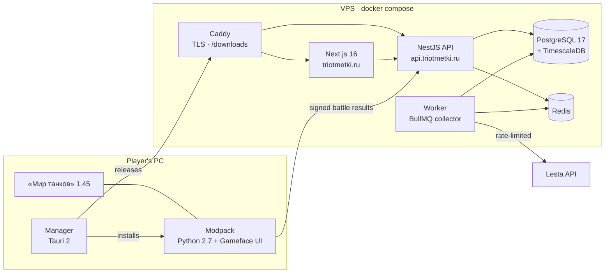

<p align="center">
  
</p>

<h1 align="center">Три отметки</h1>

<p align="center">
  <strong>The all-in-one companion for «Мир танков»: a site, a game modpack and its manager.</strong><br/>
  Player stats · Marks of excellence · Tank analytics · Clans · Replays · Streamer tools · In-game HUD · Developer API
</p>

<p align="center">
  <a href="https://triotmetki.ru"></a>
  <a href="https://api.triotmetki.ru"></a>
  
  
</p>

<p align="center">
  
  
  
  
  
  
  
</p>

<p align="center">
  <a href="#whats-inside">What's inside</a> ·
  <a href="#architecture">Architecture</a> ·
  <a href="#getting-started">Getting started</a> ·
  <a href="#commands">Commands</a> ·
  <a href="#ci-and-releases">CI and releases</a> ·
  <a href="#docs">Docs</a> ·
  <a href="#licence">Licence</a>
</p>

---

Три отметки is one place for everything a «Мир танков» (Lesta, RU realm) player looks up between battles, plus a modpack that shows the rest right in the game. It is an independent fan project, not affiliated with Lesta Games.

> [!IMPORTANT]
> Game data comes from the [Lesta API](https://developers.lesta.ru) under its terms, and they are hard rules here:
>
> - every page carries the attribution;
> - game accounts link only through Lesta ID, never with a password;
> - no ads;
> - data retention and deletion are honoured.
>
> The mod is fair play: it shows only the player's own data and what the client already shows, never enemy positions, reloads or aim.

## What's inside

<table>
  <tr>
    <td width="50%" valign="top">

### 🌐 Site — [triotmetki.ru](https://triotmetki.ru)

- **Players:** profiles with WN8, EFF and our Броня-Индекс, recent periods, sessions, activity calendar, compare, signatures.
- **Tanks:** catalogue with server stats and tier lists, tank pages, 3D armor, tech tree, builds, supertest.
- **Marks of excellence:** thresholds and their history, real mark curves from mod data, projections.
- **Clans, replays, maps and tactics:** heatmaps, a tactic board, guides, platoons, tournaments.
- **Streamers:** overlays, challenges, Twitch and VK Video Live commands, a Twitch panel.
- **Blog, shop archive, events, bonus codes and mini-games.**
- **Bots:** Telegram, Discord and VK, plus web push and email digests.
- **Три отметки Plus:** metered free tier, trial, promo codes and referrals.
- ru/en, dark and light themes, PWA, full SEO. No mocks: pages without data show honest empty states.

</td>
    <td width="50%" valign="top">

### 🎮 Modpack — `.mtmod` for client 1.45

- **41 components**, each with its own switch, as split packages or one union package.
- **Battle HUD drawn with the client's own icons:**
  - panels that replace the stock ones: team HP and score, damage log, sixth sense;
  - hit log, marks with a projection, consumables, reload, equipment;
  - arty meter and platoon points.
- **Hangar:** marks and ratings, hangar info, session stats and goals, personal bests, a tidier hangar.
- **Replays:** a replay manager and upload to the site.
- **Streamer mode and chat filter.**
- Panels move with **Alt + mouse** and stay on screen at any resolution and interface scale.

### 🧰 Manager — Tauri 2 desktop app

- Finds the game by itself; installs a ready-made set in one click.
- Components, sets and profiles; the libraries the modpack uses are credited on «О программе».
- Conflict check against third-party mods.
- Moves the modpack after a client patch; updates from our VPS.

### 🔌 Developer API

- Public `/v1` with keys and webhooks.
- A typed TypeScript client: [`@otmetki/sdk`](packages/sdk/README.md).

</td>
  </tr>
</table>

## Architecture



- **One server image, two entrypoints:** `src/main.ts` serves the site API, the developer API, auth and mod ingest; `src/worker.ts` runs the collector that pulls the Lesta API into TimescaleDB.
- **Everything is stored on the VPS:** replays and armor models on a volume, public downloads served by Caddy at `/downloads/`. There is no S3 and no CDN.

### Stack

| Layer    | Tech                                                                                                                                  |
| -------- | ------------------------------------------------------------------------------------------------------------------------------------- |
| Web      | Next.js 16, React 19 + React Compiler, next-intl, TanStack Query/Table/Virtual, visx, Base UI, cmdk, motion, Embla, SCSS modules, FSD |
| API      | NestJS 11 on Bun, better-auth (Lesta ID, Telegram, VK Mini App), Zod contracts, OpenAPI                                               |
| Worker   | BullMQ jobs, a shared Redis rate limiter, cockatiel circuit breaker                                                                   |
| Data     | PostgreSQL 17 + TimescaleDB, Prisma 7, Redis                                                                                          |
| Game mod | Python 2.7 `.mtmod` packages (tested and built on the client's own 2.7.18), React Gameface UI                                         |
| Manager  | Tauri 2: Rust core + React UI                                                                                                         |
| Tooling  | Bun workspaces + catalog, ESLint, Prettier, Stylelint, Vitest, Playwright, knip, jscpd, madge, Husky, commitlint                      |

### Repository

| Path                     | What                                                                                                                                                                               |
| ------------------------ | ---------------------------------------------------------------------------------------------------------------------------------------------------------------------------------- |
| `apps/web/client`        | Next.js 16 / React 19 site, Feature-Sliced Design, SCSS modules, motion, visx charts, next-intl ([README](apps/web/client/README.md))                                              |
| `apps/web/server`        | NestJS 11 on Bun: the API (`src/main.ts`) and the collector worker (`src/worker.ts`), the Prisma schema, the Lesta client, the replay parser ([README](apps/web/server/README.md)) |
| `apps/game/modpack`      | Python 2.7 `.mtmod` game-client modpack (core, companion, features), its Gameface UI and the component catalogue ([README](apps/game/modpack/README.md))                           |
| `apps/game/manager`      | Tauri 2 modpack manager (Rust core in `tauri/`, React UI in `web/`) ([README](apps/game/manager/README.md))                                                                        |
| `packages/ratings`       | Pure rating math: WN8, EFF, Броня-Индекс, rating tiers, recent periods, MoE projection ([README](packages/ratings/README.md))                                                      |
| `packages/schemas`       | Zod contracts shared by the client and the server ([README](packages/schemas/README.md))                                                                                           |
| `packages/gamedata`      | Pure loadout calculator (`calculateLoadout`) and the game-data model it reads ([README](packages/gamedata/README.md))                                                              |
| `packages/icons`         | Custom SVG icon set as React components; `@otmetki/icons/shapes` is its framework-free geometry ([README](packages/icons/README.md))                                               |
| `packages/design-tokens` | Design tokens as SCSS maps and mixins for the site, the manager and the in-game window ([README](packages/design-tokens/README.md))                                                |
| `packages/sdk`           | `@otmetki/sdk`, the TypeScript client for the public `/v1` API, MIT ([README](packages/sdk/README.md))                                                                             |
| `packages/logger`        | pino wrapper ([README](packages/logger/README.md))                                                                                                                                 |
| `e2e/`                   | Playwright smoke tests over the public pages                                                                                                                                       |
| `infra/caddy/`           | Caddyfile for the prod-like [docker-compose.yml](docker-compose.yml)                                                                                                               |
| `docs/`                  | Architecture, guides, ops, product, research, specs ([index](docs/README.md))                                                                                                      |

`packages/` holds only code shared between apps; anything a single app uses lives inside that app.

## Getting started

You need [mise](https://mise.jdx.dev) and Docker. [mise.toml](mise.toml) pins the toolchain: Bun, Node, Python 2.7.18 (the game client's own version, which runs the modpack's code, tests and tooling) and Rust for the manager. The modpack's Python packages come from `apps/game/modpack/tools/requirements.txt`.

```bash
mise install             # Bun, Node, Python 2.7, Rust at the pinned versions
python -m ensurepip && python -m pip install -r apps/game/modpack/tools/requirements.txt   # the modpack tooling's packages
bun install
cp .env.example .env     # set INTERNAL_API_TOKEN; the secrets are listed below
bun run dev:infra        # TimescaleDB :5434, Redis :6380, Mailpit :1025 (inbox :8025)
bun run db:push          # extensions + prisma db push + the Timescale layer
bun run gamedata:import  # optional: vehicles, modules, equipment and maps from the public client-data repos
bun run dev              # server :4000 + client :3000
```

`bun run dev:all` also starts the worker, `bun run dev:manager` starts the manager, and `bun run dev:modpack` builds the modpack, installs it into the local client's `mods/<version>/otmetki-dev` and reinstalls it on every change ([dev loop](apps/game/modpack/README.md#dev-loop)).

The server refuses to start without these secrets, each at least 32 characters (`openssl rand -base64 32`). `.env.example` carries development values for all but `INTERNAL_API_TOKEN`; production needs fresh ones ([docs/ops/deploy.md](docs/ops/deploy.md)).

| Variable                  | What                                                                                                         |
| ------------------------- | ------------------------------------------------------------------------------------------------------------ |
| `BETTER_AUTH_SECRET`      | better-auth sessions                                                                                         |
| `INTERNAL_API_TOKEN`      | the Next server's calls to the API; both read the same value                                                 |
| `TOKEN_ENCRYPTION_SECRET` | encrypts the stored Lesta and streamer integration tokens; rotating it makes them unreadable (users re-link) |
| `MOD_INGEST_SECRET`       | the root of every mod device key; rotating it unbinds every device                                           |

> [!NOTE]
> **No Lesta key? Everything still runs.** There is no mock and no generated data anywhere.
>
> - With `LESTA_APPLICATION_ID` empty, the server boots, the worker starts in degraded mode and every page shows its empty state.
> - `LESTA_NOTICE=true` adds the site-wide «data not connected yet» banner. It is a runtime switch: restart the client, no rebuild needed.
> - `bun run gamedata:import` still fills the tank catalogue, maps and missions.

<details>
<summary><strong>Dev server troubleshooting</strong></summary>

<br/>

`bun run dev` and `dev:all` restart a crashed server or client by themselves (`concurrently --restart-tries`). Ctrl+C still stops everything.

- **`next dev` slowly eats memory or stops answering.** Stop it, delete `apps/web/client/.next/dev` and start again. The dev-only settings in [apps/web/client/config/dev-server.ts](apps/web/client/config/dev-server.ts) keep memory flat:
  - Turbopack's disk cache stays on;
  - memory eviction is `'full'`;
  - the React Compiler runs through its Rust port;
  - webpack loaders run in worker threads;
  - `reactDebugChannel` is off. With it on, Next 16.3 holds every HTML request that never opens an HMR socket.

  `dev:client` also caps the V8 heap at 6 GB, so Next restarts itself before the machine runs out of memory.

- **The API disappears.** `dev:server` and `dev:worker` run under `nodemon` ([apps/web/server/nodemon.json](apps/web/server/nodemon.json)), which watches only the server's own sources, because Bun's `--watch` crashes on Windows. After a real crash, save any file or type `rs` + Enter.
- **Need a second `next dev`?** Start it with `NEXT_DIST_DIR=.next/probe` and another `-p`.
- **Disk:** the Turbopack cache can reach tens of GB. Deleting `.next/dev` while the dev server is stopped is always safe.

</details>

## Commands

| Command                                                                                | What                                                                        |
| -------------------------------------------------------------------------------------- | --------------------------------------------------------------------------- |
| `bun run dev` · `dev:all` · `dev:client` · `dev:server` · `dev:worker` · `dev:manager` | Dev servers                                                                 |
| `bun run dev:modpack`                                                                  | Modpack dev loop: build, install into the local client, reinstall on change |
| `bun run dev:infra` · `dev:infra:down`                                                 | Local TimescaleDB, Redis and Mailpit                                        |
| `bun run db:push` · `db:reset` · `db:studio`                                           | Schema sync (no migrations before production), full reset, Prisma Studio    |
| `bun run gamedata:import`                                                              | Import the game client's data                                               |
| `bun run verify`                                                                       | typecheck + lint + import cycles + UTF-8 + format + styles: what CI runs    |
| `bun run fix`                                                                          | Auto-fix lint, formatting, styles and the Prisma schema                     |
| `bun run test` · `test:changed`                                                        | Vitest across the monorepo · only the tests your uncommitted changes reach  |
| `bun run test:modpack`                                                                 | The modpack's Python suites                                                 |
| `bun run test:e2e` · `e2e:screens`                                                     | Playwright smoke · the screenshot suite                                     |
| `bun run lint:unused` · `lint:dupes`                                                   | knip (unused files, exports, dependencies) · jscpd (copy-paste)             |
| `docker compose up -d --build`                                                         | Production-like stack: Caddy, client, server, worker, db, redis             |

Use `bun run test`, never `bun test`.

## CI and releases

| Workflow                                 | When                                        | What                                                                                                                                                        |
| ---------------------------------------- | ------------------------------------------- | ----------------------------------------------------------------------------------------------------------------------------------------------------------- |
| [deploy](.github/workflows/deploy.yml)   | manual                                      | verify, tests, modpack suites and the e2e smoke, then client and server images to ghcr and a rollout on the VPS. Code that already passed skips the checks. |
| [release](.github/workflows/release.yml) | manual                                      | Builds the modpack and the manager for versions not yet on the VPS and publishes them there                                                                 |
| [modpack](.github/workflows/modpack.yml) | PRs touching `apps/game/modpack`, or manual | the Python 2.7 suite and ruff; a manual release build of the packages and the component catalogue                                                           |
| [manager](.github/workflows/manager.yml) | PRs touching the manager, or manual         | UI checks, `cargo fmt` / `clippy` / `test` on Windows; a manual NSIS installer build                                                                        |

To release, bump `version` in [apps/game/modpack/package.json](apps/game/modpack/package.json) (its `otmetki.games` lists the supported clients) or in [apps/game/manager/package.json](apps/game/manager/package.json), commit, and run **release**: it publishes whichever of the two has a version not yet in the published index. The first production deploy follows [docs/ops/deploy.md](docs/ops/deploy.md).

## Docs

| Start here                                                                         |                                            |
| ---------------------------------------------------------------------------------- | ------------------------------------------ |
| [docs/README.md](docs/README.md)                                                   | Index of every doc                         |
| [docs/product/features.md](docs/product/features.md)                               | Product scope and what is done             |
| [docs/specs/2026-09-24-otmetki-design.md](docs/specs/2026-09-24-otmetki-design.md) | Architecture                               |
| [docs/guides/](docs/guides/README.md)                                              | Code style: client, server, shared         |
| [docs/architecture/fsd.md](docs/architecture/fsd.md)                               | Feature-Sliced Design in the client        |
| [docs/research/data/lesta-api.md](docs/research/data/lesta-api.md)                 | Lesta API reference and terms              |
| [apps/game/manager/README.md](apps/game/manager/README.md)                         | The modpack manager                        |
| [apps/web/server/README.md](apps/web/server/README.md)                             | The server: API, worker, data retention    |
| [docs/ops/deploy.md](docs/ops/deploy.md)                                           | The first production deploy                |
| [apps/game/modpack/README.md](apps/game/modpack/README.md)                         | The modpack and its components             |
| [CLAUDE.md](CLAUDE.md)                                                             | Guidance for AI agents working in the repo |

## Contributing

- **Commits:** conventional commits, enforced by commitlint.
- **Pre-commit hook:** lint-staged, a typecheck of the touched workspaces, and the modpack suites when Python changes.
- **Code:** every user-facing string goes through next-intl in ru and en. Shared contracts live in `@otmetki/schemas`. Ready-made packages are preferred over custom code.

## Licence

Proprietary: © 2026 Alexandr Artemev, all rights reserved, see [LICENSE](LICENSE). Viewing the source grants no licence to use, copy, modify or distribute it. The public API client [`@otmetki/sdk`](packages/sdk) is MIT ([packages/sdk/LICENSE](packages/sdk/LICENSE)). Third-party works that ship with the site, the modpack and the manager keep their own licences: [THIRD_PARTY_NOTICES.md](THIRD_PARTY_NOTICES.md).

---

<p align="center">
  <sub>© 2026 Alexandr Artemev. «Мир танков» and all related game content are the property of Lesta Games.</sub>
</p>
